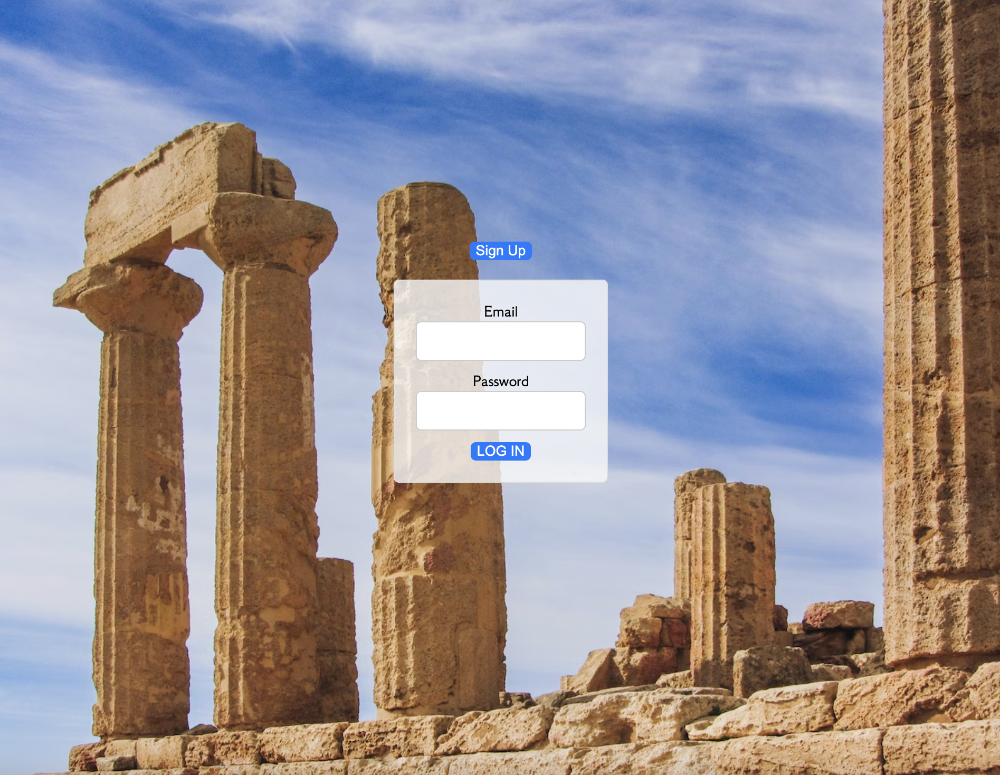
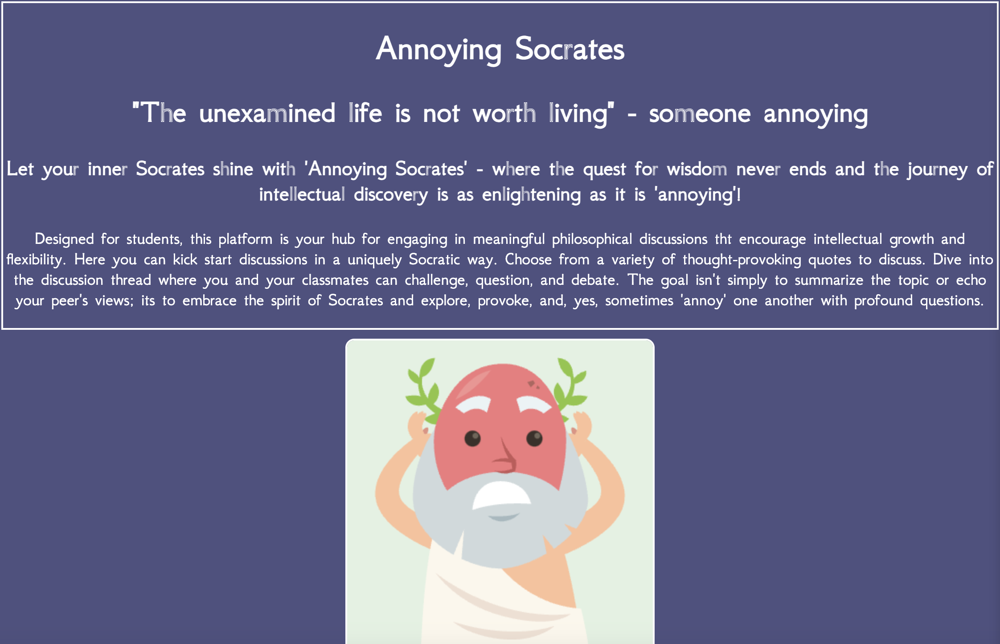
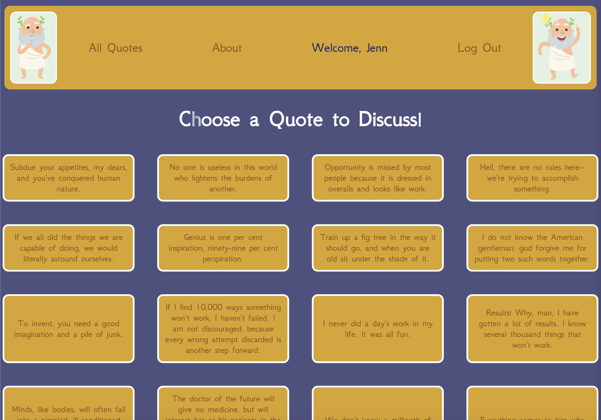
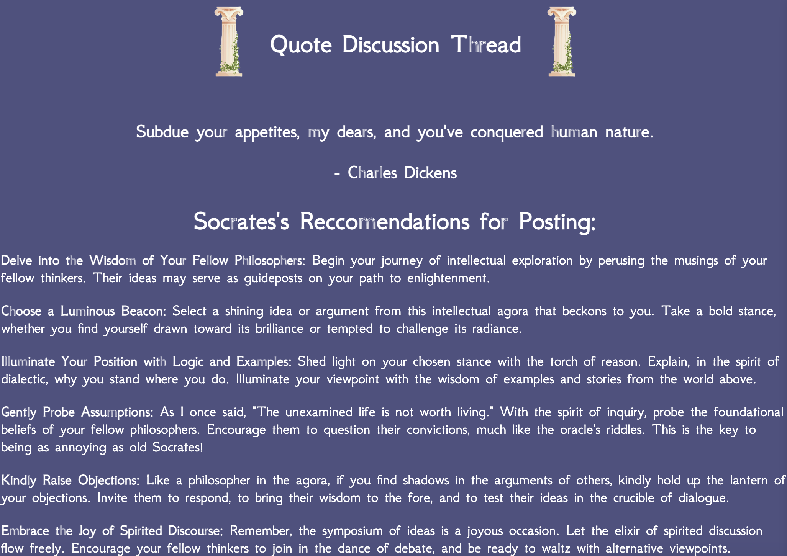
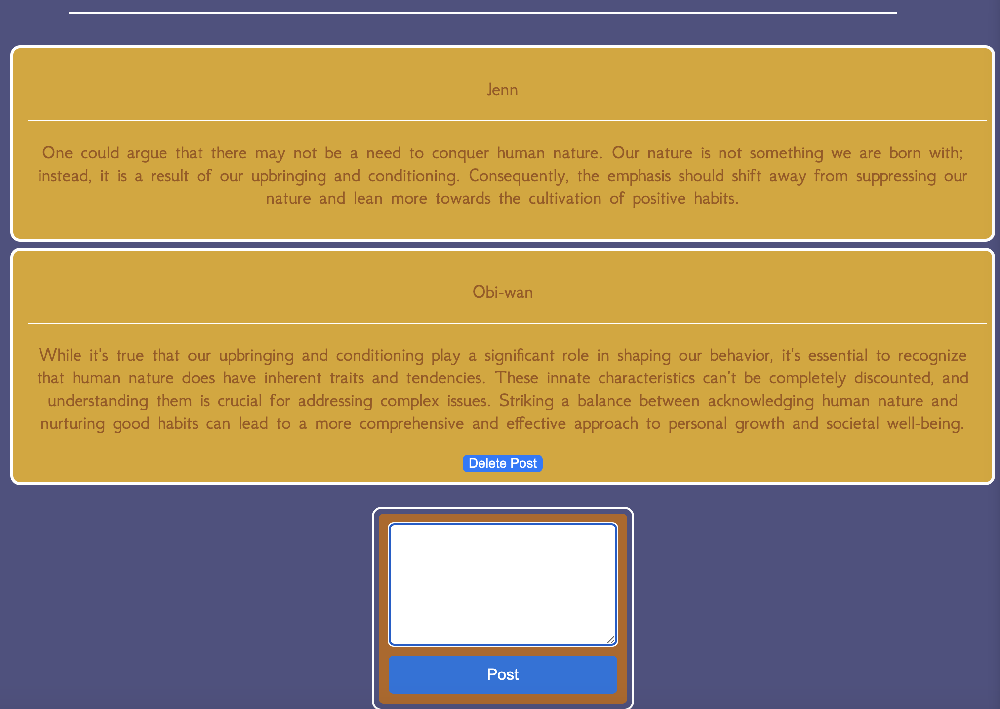

## Annoying Socrates
- Let your inner Socrates shine with 'Annoying Socrates' - where the quest for wisdom never ends and the journey of intellectual discovery is as enlightening as it is 'annoying'!
- Designed for students, this platform is your hub for engaging in meaningful philosophical discussions tht encourage intellectual growth and flexibility. 
- Here you can kick start discussions in a uniquely Socratic way. Choose from a variety of thought-provoking quotes to discuss. Dive into the discussion thread where you and your classmates can challenge, question, and debate. 
- The goal isn't simply to summarize the topic or echo your peer's views; its to embrace the spirit of Socrates and explore, provoke, and, yes, sometimes 'annoy' one another with profound questions.

## Images of Application
- Sign In Page

- About Page

- Index Page

- Posts Page

## Technologies Used
- Mongoose
- MongoDB
- Express
- React
- Node.js
- HTML
- CSS
- JavaScript
- Quotable 3rd party API
- Vite
- Trello
- Lucidchart

## Getting Started
- [Link to Application]()
- [Project Planning](https://trello.com/b/VG7Mz2RQ/annoying-socrates)

## Next Steps
- As a user I want there to be a moderator who can delete anyone's posts/discussions because it is an educational environment and not all posts may be conductive to that
- As a user I want to have a user profile where I can introduce myself as a philosopher and see my stats (how many posts I have made etc) and and badges (based on how many posts I have made and how many people have linked my posts)
- As a user I want to be able to like someone else's post to show them that their post made me think and encourage them in their ideas
- As a user I want to be able to update posts that I have made in case I want to edit them